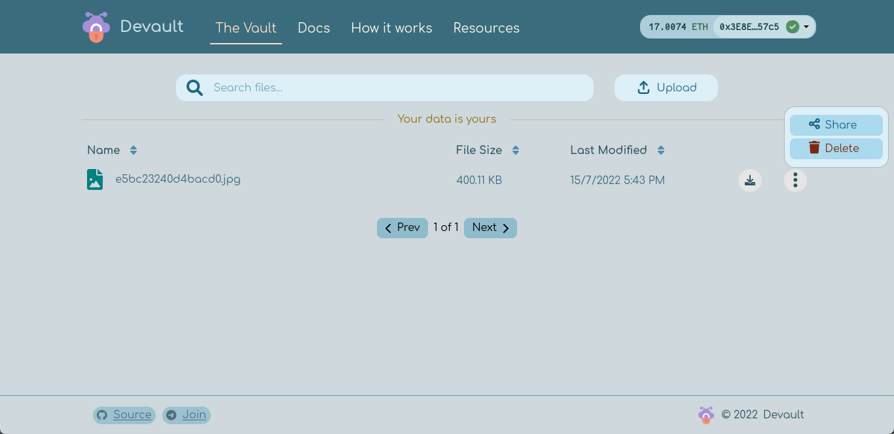

# Devault -  The Decentralized Vault

Devault is a decentralized, self-hosted, and end-to-end encrypted alternative to proprietary and centralized cloud storage.

## Stack

`Next.js`
`HardHat`
`Ethers.js`
`Docker`

## Keywords

`Blockchain`
`Cryptography`
`Decentralization`
`Self-hosting`
`Cloud Storage`
`Peer-to-Peer Network`

## Deployment

- [Centralized server](https://devault.vercel.app)
- [Decentralized](https://devault.on.fleek.co)
- [Docker](https://hub.docker.com/r/abdeltwabmf/devault)

## Screenshots

|                           |                           |
|---------------------------|---------------------------|
|  |  |
|  |  |
|  |  |
|  |  |

## Source Code

- [Thesis](https://github.com/AbdeltwabMF/devault-thesis/tree/main/thesis)
- [Presentation](https://github.com/AbdeltwabMF/devault-thesis/tree/main/presentation)
- [Source Code](https://github.com/AbdeltwabMF/devault)

## License

Licensed under the [GPL v3](https://github.com/AbdeltwabMF/devault/LICENSE) License.

This is free software: you are free to change and redistribute it.
There is NO WARRANTY, to the extent permitted by law.
